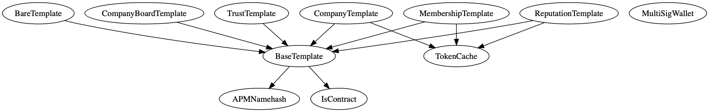
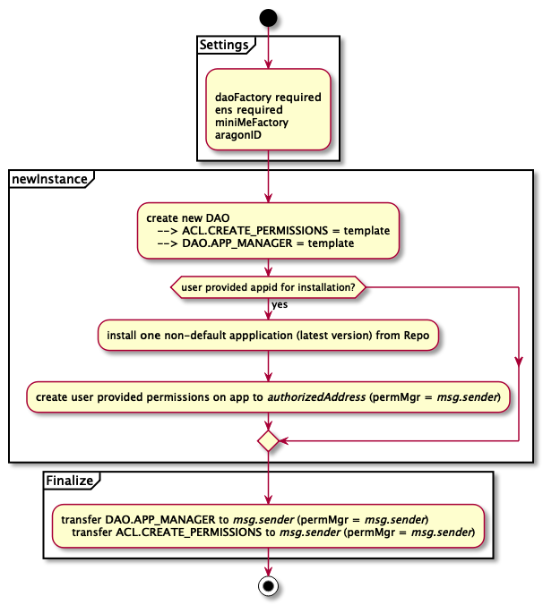

<!-- This file is autogenerated. DO NOT EDIT. -->

# Aragon DAO Templates Audit


* [1 Summary](#1-summary)
* [2 Audit Scope](#2-audit-scope)
  * [2.1 Out of Scope](#21-out-of-scope)
* [3 System Overview](#3-system-overview)
  * [3.1 Detailed Design](#31-detailed-design)
* [4 Key Observations/Recommendations](#4-key-observationsrecommendations)
* [5 Security Specification](#5-security-specification)
  * [5.1 DAO Templates](#51-dao-templates)
* [6 Issues](#6-issues)
  * [6.1 Company-Board - `Kernel.APP_MANAGER` permission should be ruled by Shareholders instead of Board members](#61-company-board---kernelapp_manager-permission-should-be-ruled-by-shareholders-instead-of-board-members)
  * [6.2 Inconsistent Permission Specification `DISABLE_PAYMENTS`](#62-inconsistent-permission-specification-disable_payments)
  * [6.3 Company-Board - Inconsistent permissions in Agent application](#63-company-board---inconsistent-permissions-in-agent-application)
  * [6.4 Company-Board - Inconsistent permissions in Finance application](#64-company-board---inconsistent-permissions-in-finance-application)
  * [6.5 Payroll is missing permissions to create payments on Finance](#65-payroll-is-missing-permissions-to-create-payments-on-finance)
  * [6.6 Reputation - Missing data location for argument](#66-reputation---missing-data-location-for-argument)
  * [6.7 Specification Inconsistencies](#67-specification-inconsistencies)
  * [6.8 Input Validation - aragonId should be checked for empty string](#68-input-validation---aragonid-should-be-checked-for-empty-string)
  * [6.9 Company, Reputation, Membership - Code Duplications](#69-company-reputation-membership---code-duplications)
* [7 Tool-Based Analysis](#7-tool-based-analysis)
  * [7.1 MythX](#71-mythx)
  * [7.2 Ethlint](#72-ethlint)
  * [7.3 Surya](#73-surya)
* [Appendix 1  - Disclosure](#appendix-1----disclosure)


## 1 Summary

ConsenSys Diligence conducted a security audit on the Aragon 0.8 DAO Templates.

* **Project Name:** Aragon dao-templates v0.8
* **Client Name:** Aragon
* **Client Contact:**  Louis Giraux (association@aragon.org), Brett Sun
* **Lead Auditor:** Martin Ortner
* **Co-auditors:** Sergii Kravchenko
* **Date:** 23 Aug 2019
* **Duration:** 1 week
## 2 Audit Scope

This audit covered the following files:

| File Name                                                  | SHA-1 Hash                               |
| ---------------------------------------------------------- | ---------------------------------------- |
| shared/contracts/BaseTemplate.sol                          | a085e3acea08f4ba74f1f6afbbd00045d011db22 |
| shared/contracts/TokenCache.sol                            | e93cbe72cf6f804e436889f1fa4add21cd5bfe00 |
| templates/bare/contracts/BareTemplate.sol                  | 7f02ee0a1af3e8d9089a71eb782ef9d18e8aa017 |
| templates/company-board/contracts/CompanyBoardTemplate.sol | 8af07ce7ff299b48c89fdf165cd8efa45309a82e |
| templates/company/contracts/CompanyTemplate.sol            | 6a34bac42ea02ee4abbfdcbf0437e9db0e9a1e9b |
| templates/membership/contracts/MembershipTemplate.sol      | eaebf63b173efdbc8252318cbd2a29bebdd15e43 |
| templates/reputation/contracts/ReputationTemplate.sol      | 9ff127c82c20cb087a66a41eba5c05fb4c8d9668 |
| templates/trust/contracts/MultiSigWallet.sol               | c2448282059bb320f6ca0fa55f2038b6b22a1a2b |
| templates/trust/contracts/TrustTemplate.sol                | 8748bf3bb596433517d373176d57c7e8d1561a53 |

Client's priority for the agreed duration of the audit (in order):
* High Priority
  * Company
  * Company-Board
  * Membership
  * Reputation
* Low Priority (if time permits)
  * Bare
  * Trust


### 2.1 Out of Scope

* `MulstiSigWallet.sol` - was excluded from the audit scope. Nevertheless, the audit team verified that `MultiSigWallet.sol` is code-identical to the [original gnosis MultiSigWallet implementation](https://github.com/gnosis/MultiSigWallet/blob/95d51ae89ddec56859720fbb28cfe9d6732a26cf/contracts/MultiSigWallet.sol).
* `TrustTemplate.sol` - The Trust DAO template was excluded from scope due to time constraints and complexity of the templates that would not allow a thorough and responsible audit result within the time scheduled.
* The upgrade to `@aragon/apps-agent@2.0.0-rc.1` with [aragon/dao-templates#135](https://github.com/aragon/dao-templates/pull/135) is not part of this audit.

The audit team evaluated that the system is secure, resilient, and working according to its specifications. The audit activities can be grouped into the following three broad categories:

1. **Security:** Identifying security related issues within the contract.
2. **Architecture:** Evaluating the system architecture through the lens of established smart contract best practices.
3. **Code quality:** A review of the contract source code. The primary areas of focus include:
   * Correctness
   * Readability
   * Scalability
   * Code complexity

## 3 System Overview


Aragon provides so-called DAO Template contracts to support the deployment of Aragon organizations. The templates model common organizational structures or DAO scenarios. They aim to provide a way to kickstart an organization and customize it to a client's need. A DAO Template contract deploys a new DAO, installs applications (e.g. those in [aragon-apps](https://github.com/aragon/aragon-apps/)) required for the DAO scenario, initializes and configures them, and defines the trust relationships between components.

With Aragon 0.8, the following templates are available:

* Company
* Company-Board
* Membership
* Reputation
* Trust (not in scope - see [Audit Scope](#2-audit-scope))

### 3.1 Detailed Design

The DAO templates are split into a common part used by many templates which can be found in the `./shared/` folder and implements functionality that caters to all the scenario-specific templates. The `BaseTemplate` defines constants like the aragonPM name hashes of available applications and provides functionality to deploy a bare DAO, register it on ENS, install applications, and set-up and transfer permissions. `TokenCache` provides functionality to cache a token across DAO creation transactions. Similar functionality exists to cache multiple tokens, apps or an incomplete DAO set-up where a multi-step deployment is required (`company-board` and `trust` templates). Due to the design of the cache, the two-step deployment allows only one DAO to be prepared at a time by a deployer.

The following image provides a high-level components centric view on Aragon applications, their interfaces, the roles they export, and some annotations about who interacts with them.


#### aragonOS

##### DAO Application and Permission management

A new DAO is deployed by creating a new `KernelProxy` for the DAO Kernel implementation and setting an initial admin (`CREATE_PERMISSIONS_ROLE`). The `Kernel` contains an app mapping, provides functionality to install apps by deploying app proxies, and implements upgradeability for both the kernel and apps. Permissions are managed by the `ACL` subsystem that controls who has permissions to execute an action in an Aragon application and who can re-grant or revoke that permission (a permission's "manager").

As outlined in the right part of the diagram, the initial admin may grant `Kernel.APP_MANAGER_ROLE` to an account. This account will be allowed to install/update/manage applications for the DAO. The initial admin may grant or revoke DAO or application specific permissions to an account and specify an account that acts as the permission manager for the specific role.

Exported permissions:

* `Kernel.APP_MANAGER_ROLE`
* `ACL.CREATE_PERMISSIONS_ROLE`

For reference, `ACL` provides the following interfaces to manage permissions:

* Creates a permission that wasn't previously managed.

    `function createPermission(address _entity, address _app, bytes32 _role, address _manager)`

* Grants permission if allowed. This requires `msg.sender` to be the permission manager.

    `function grantPermission(address _entity, address _app, bytes32 _role)`

 * Grants a permission with parameters if allowed. This requires `msg.sender` to be the permission manager.
 
    `function grantPermissionP(address _entity, address _app, bytes32 _role, uint256[] _params)`

 * Revokes permission if allowed. This requires `msg.sender` to be the permission manager.

    `function revokePermission(address _entity, address _app, bytes32 _role)`

 * Set `_newManager` as the manager of `_role` in `_app`. This requires `msg.sender` to be the permission manager.

    `function setPermissionManager(address _newManager, address _app, bytes32 _role)`

 * Remove the manager of `_role` in `_app`. This requires `msg.sender` to be the permission manager.

    `function removePermissionManager(address _app, bytes32 _role)`

 * Burn non-managed `_role` in `_app`, so no later modifications can be made (e.g. grant, revoke, permission manager).

    `function createBurnedPermission(address _app, bytes32 _role)`

 * Burn `_role` in `_app`, so no later modification can be made (e.g. grant, revoke, permission manager). This requires `msg.sender` to be the permission manager.

    `function burnPermissionManager(address _app, bytes32 _role)`

##### Applications

The following applications from [aragon-apps](https://github.com/aragon/aragon-apps/) are provided to organizations through the templates.

###### Agent

An agent allows performing arbitrary calls to contracts and therefore acts as an external interface of the DAO. It allows the DAO to participate as a stakeholder in other contracts or DAOs. The agent also implements the `Vault` application (see below). As outlined in the diagram, roles can be assigned to any address.

The `EXECUTE_ROLE` allows an entity to perform arbitrary calls to contract with `ETH` value transfer with user provided call-data (`execute(target, ethValue, calldata)`). The `RUN_SCRIPT_ROLE` allows an entity to execute an `evmScript` by calling `forward(evmScript)`, which may call arbitrary addresses depending on the evmscript executor (without `ETH` value transfer). Both methods allow an entity owning the permission to call addresses within the DAO or external to the DAO on behalf of the `Agent`.

Exported permissions:

* `Agent.EXECUTE_ROLE`
* `Agent.RUN_SCRIPT_ROLE`
* `Agent.ADD_PRESIGNED_HASH_ROLE`
* `Agent.DESIGNATE_SIGNER_ROLE`

With [aragon/dao-templates#135](https://github.com/aragon/dao-templates/pull/135) the Agent application will be updated to `@aragon/apps-agent@2.0.0-rc.1` providing new functionality and exporting the following additional permissions: 

* `Agent.SAFE_EXECUTE_ROLE`
* `Agent.ADD_PROTECTED_TOKEN_ROLE`
* `Agent.REMOVE_PROTECTED_TOKEN_ROLE`

The `SAFE_EXECUTE_ROLE` allows an entity to execute a low-level call to an arbitrary address with call-data and without a value transfer. The method checks that protected tokens cannot be spent.

Please note that the upgrade to `@aragon/apps-agent@2.0.0-rc.1` is not part of this audit.


###### Finance

The finance application is the central point to keep track of income and expenses (`ETH` or ERC20 tokens). It can be used to create recurring or one-time payments. Finances are accounted in configurable financial periods (e.g. quarters). A limit on how many units of a token can be spent per period can be defined (budget) with the default being unlimited. If it is set, Finance will only allow the budgeted amount of tokens to be spent for the period. The balance for a period can be negative if it is overspent. The Finance application does not hold funds on its own but interacts with a `Vault` or `Agent` application to execute the payment. Financial statements cannot be created manually as they are always based on deposit or spent transactions/events.

An entity allowed to create immediate payments in a system that is not restricted by budgets may be able to spend all of a DAO's funds.

Exported permissions:

* `Finance.CREATE_PAYMENTS_ROLE`
* `Finance.CHANGE_PERIOD_ROLE`
* `Finance.CHANGE_BUDGETS_ROLE`
* `Finance.EXECUTE_PAYMENTS_ROLE`
* `Finance.MANAGE_PAYMENTS_ROLE`


###### Voting

Allows the DAO to execute arbitrary actions based on voting results.

An entity may create a vote that executes `evmScript` when it passes. Stakeholders in the DAO (token holders) can vote with their stake in votings.

Exported permissions:

* `Voting.CREATE_VOTES_ROLE`
* `Voting.MODIFY_SUPPORT_ROLE`
* `Voting.MODIFY_QUORUM_ROLE`

###### Survey

A survey application similar to `Voting` for signaling to support and establish community sentiment. It cannot execute any actions.

Token holders may participate in surveys with their stake.

Exported permissions:

* `Survey.CREATE_SURVEYS_ROLE`
* `Survey.MODIFY_PARTICIPATION_ROLE`

###### Token Manager

The TokenManager is an abstraction and the controller of a `MiniMeToken`. A TokenManager for a specific `MiniMeToken` is set by calling `MiniMeToken.changeController(TokenManager)`. One TokenManager can only be the controller of one `MiniMeToken`. The TokenManager can mint and destroy tokens, assign them freely, and define token vestings. Token transfers on a controlled `MiniMeToken` cause a `hook` to be called on the `TokenManager` which then decides whether to allow or reject the action.

Token holders of the controlled `MiniMeToken` may perform actions on behalf of the `TokenManager`, e.g. to create votes or call arbitrary commands by calling `TokenManager.forward(evmScript)`. If the `TokenManager` permits, a token holder may freely transfer tokens to other parties.


Exported permissions:

* `TokenManager.MINT_ROLE`
* `TokenManager.ISSUE_ROLE`
* `TokenManager.ASSIGN_ROLE`
* `TokenManager.REVOKE_VESTINGS_ROLE`
* `TokenManager.BURN_ROLE`

###### Vault

The value store of the DAO. It manages `ERC20` token and `ETH` assets.

An entity owning the permission to transfer funds has full control over the DAO's assets.

Exported permissions:

* `Vault.TRANSFER_ROLE`

###### Payroll

An application to manage on-chain salary payments that allows employees to see their available balance and request payments.

Exported permissions:

* `Payroll.ADD_EMPLOYEE_ROLE`
* `Payroll.TERMINATE_EMPLOYEE_ROLE`
* `Payroll.SET_EMPLOYEE_SALARY_ROLE`
* `Payroll.ADD_BONUS_ROLE`
* `Payroll.ADD_REIMBURSEMENT_ROLE`
* `Payroll.ALLOWED_TOKENS_MANAGER_ROLE`
* `Payroll.CHANGE_PRICE_FEED_ROLE`
* `Payroll.MODIFY_RATE_EXPIRY_ROLE`


#### DAO Templates

The following section describes the DAO Templates in more detail.

Please refer to [5 Security Specification](#5-security-specification) for a discussion about the security properties.

<p align="center">
<figcaption>
 <a href="./tool-output/surya/graph.dot">dot file</a>
 </figcaption>
 </p>

##### Inheritance Graph
A complete view of the inheritance structure:



##### Components

An actor-centric view on the DAO Templates indicating what functionality is exposed by the DAO deployment contracts for `Bare`, `Reputation`, `CompanyBoard`, `Company`, `Membership` and the `Trust` template is shown in the following class diagram. Externally reachable methods are annotated in green, internal and private functions are yellow or red. A magnifying glass indicates that the function is pure or view-only. State and constant variables are listed in the top area of the class illustration.


##### Bare Template

The following illustration provides an overview of the high level setup steps for this template.



The `Bare` template - as the name suggests - deploys a minimum viable DAO. No token will be created by this template. The DAO's name will not be registered with ENS. The template optionally allows to initialize **one** application of the callers choice and finally transfers permissions to the caller. The application will be initialized with the user provided `initializeCalldata`. No input validation is or even can be performed on that data. The caller can also provide a list of permissions to create on the application. No input validation is performed on this list as well. Applications that require the presence of a token might not be functional as no token is deployed with the DAO. The DAO's token might pre-exist though. However, any token can be used and it can even be non-conformant to the `MiniMeToken` implementation generally used.

The result is a minimum viable DAO that is barely functional and requires additional manual effort to be finalized. Please note that there is considerable risk of misconfiguration for this DAO template. The resulting DAO is both non-transparent as the setup is not fully self-contained in a smart-contract and centralized with the deployer being the single point of trust. Even if an application is initially deployed with the template, the application might not be fully functional (e.g. due to dependencies on other applications being installed).

The DAO comes with an unmanaged default `EVMScriptRegistry` that includes the `CallScript` executor for use with the forwarding functionality in applications.

This template is meant to be further customized.

##### Company Template

The following illustration provides an overview of the high level setup steps for this template.


The `Company` template is similar to the Aragon v0.7 [democracy kit](https://github.com/aragon/dao-templates/tree/9886bba4c0a201bf056f44d751373e5d804e1b90/kits/democracy) with the difference that the `Voting.MODIFY_SUPPORT` permission is not burned. The company template is based on a token with 18 decimals that is transferable with no limit being set on how many tokens a single account can hold. Token holders with their stakes are the key decision makers.

The template creates the new token according to the token parameters as defined in the contract and deploys a new DAO, initially assigning `CREATE_PERMISSIONS` and `APP_MANAGER` roles to itself. Subsequently the DAO apps are installed and initialized, tokens are minted and the apps' permissions are set up. Finally, the `CREATE_PERMISSIONS` and `APP_MANAGER` roles are transferred to the Voting application to allow the token holders to vote on DAO related decisions and an ENS name for the DAO is registered.

This template is similar to `Reputation` and `Membership`. The main differences are:
* `Reputation` does not allow token transfers.
* `Membership` defines a fixed stake of one token per member and the token is not transferable.


##### Reputation Template

The following illustration provides an overview of the high level setup steps for this template:


While the token configuration is different, the permission setup is basically similar to `Company`. The token is configured to not be transferable.

This template is similar to `Company` and `Membership`. The main differences are:
* `Company` does allow token transfers.
* `Membership` defines a fixed stake of one token per member.


##### Membership Template

The following illustration provides an overview of the high level setup steps for this template.


The setup is basically similar to `Company` with the token not being transferable and every member receiving only one token. The `TOKEN_MAX_PER_ACCOUNT` setting ensures that each token holder's balance cannot exceed one token even after the initial minting during the DAO deployment.

This template is similar to `Company` and `Reputation`. The main differences are:
* `Company` does allow token transfers.
* `Reputation` allows members to have an arbitrary number of tokens.

##### Company-Board Template

The following illustration provides an overview of the high level setup steps for this template. The deployment is performed in two steps.


This template is based on two major groups of actors. The **Board** is represented by `BOARD` token holders, using a membership token (non transferable, one per member) that can be used to vote in the board voting application, and the **Shareholders** are represented by `SHARE` token holders, using a token that is transferable with no limit on how many tokens a token holder can possess that can be used to vote in the shareholder voting application.

The DAO is set up by first creating the `BOARD` and `SHARE` tokens, then deploying the DAO while initially assigning `CREATE_PERMISSIONS` and `APP_MANAGER` roles to the template contract for further configuration. Subsequently the voting applications for `BOARD` and `SHARE` are installed and configured. Next, the Vault and Finance applications are installed, initialized, and have their permissions set up accordingly. After this, Payroll is installed and has its permissions set up before finalizing the rest of the permissions on the apps. Finally, the `CREATE_PERMISSIONS` and `APP_MANAGER` roles are transferred to the `Voting_BOARD` application to allow the `BOARD` to manage DAO related decisions and an ENS name for the DAO is registered.

Shareholders via `Voting_SHARE` are set to own and manage most permissions in the system.

Board members are granted the following permissions via `Voting_BOARD`:
* `APP_MANAGER`
* `CREATE_PERMISSIONS`
* All relevant payroll permissions (also being permission manager)
* `CREATE_PAYMENTS`, `MANAGE_PAYMENTS`, and `EXECUTE_PAYMENTS` on Finance
* `EXECUTE` calls and `RUN_SCRIPT` on Agent/Vault

## 4 Key Observations/Recommendations

* Basic documentation including raw specifications, descriptions, an overview of the permissions and inline documentation for contracts and their exposed functionality is available.

* The code is well written and split up into a `BaseTemplate` with shared functionality intended to be used by the individual DAO manifestations.

* `Company`, `Membership` and `Reputation` unnecessarily duplicate code leading to minor discrepancies between the code-bases.

* The `Bare` template does not deploy a fully configured and therefore usable DAO.

* Trust assumptions for the `Bare` template highly depend on how the DAO configuration is finalized.

* The DAO Templates, similar to aragonOS, uses Solidity version `0.4.24` which is **not** in the latest major version branch of Solidity.

* Payroll has no permissions to create payments on Finance. `payday()` will therefore not be functional.

* The Survey application is not used by any of the DAO templates.


## 5 Security Specification

This section describes, **from a security perspective**, the expected behavior of the system under audit. It is not a substitute for documentation. The purpose of this section is to identify specific security properties and encourage a discussion about security threats to - and trust assumptions of - the system.

The DAO Template contracts can be seen as blue-prints for common DAO scenarios. They initially specify the trust boundaries, actors and functionality provided, the standard applications involved and their configuration as well as the distribution of power that comprises the DAO's intended use case. It is important to note that certain roles in a DAO allow modifications of the DAO after deployment, even when using a DAO template. This is especially true in the beginning of a DAO's life where a smaller group of majority shareholders might have the power to change and decide on core attributes and functionality of the DAO. Deploying a DAO from an audited template is therefore no certification that a DAO is set-up correctly for later users. Furthermore, DAO templates make use of a on-chain repository to retrieve the address of the latest implementation of an application. This information can be updated at any point in time, asynchronous to the release of a new DAO template, given an entity owns the necessary role and permissions to do the repository update. Application implementations are therefore not in scope for this audit.


### 5.1 DAO Templates

* The maintainer of a deployed DAO Template may be in control of the application repository that is used with the template and therefore may be able to update application implementations and front-run the DAO deployer, which may result in an unexpected application being deployed.

* Forwarding functionality in various applications widens the general attack vectors of the system. At this time, no critical attack vectors have been identified.

* `Payroll` provides forwarding functionality for Employees that allows them to execute CallScripts by default. The DAO's Finance application is implicitly black-listed by the `Payroll` application code during forwarding, disallowing Employees from exploiting a potential `Payroll <--> Finance` trust relationship. Please refer to the [Payroll audit](https://github.com/ConsenSys/aragon-payroll-audit-report-2019-06) for further observations, recommendations and discussions on the trust relationship.

* `Agent` allows permission grantees (usually Voting) to run arbitrary CallScripts by default or execute arbitrary calls with an ether value transfer.

* `TokenManager`s allow token holders to run arbitrary CallScripts by default. This is usually used to create votes. The managed `MiniMeToken` is implicitly black-listed by the `TokenManager` application during forwarding, disallowing token holders from exploiting a direct relationship to the token.

* Forwarding functionality can generally be exploited to proxy calls to other contracts.

* An `EVMScriptManager` permission grantee may add a backdoored or malicious script executor, e.g. to bypass blacklisting restrictions in the default `CallScript` executor or to execute arbitrary actions.

* `Kernel.APP_MANAGER` permission grantee may install, modify or upgrade applications to bypass restrictions or undermine trust assumptions.

* Voting systems are often the back-bone of the DAOs.
  * In many cases token holders or a special group of DAO members can create votes for benign looking actions that may execute malicious evmscripts in the end. It is therefore paramount for token holders to verify that a vote's action (`evmScript`) actually reflects the vote's intention and does not perform any malicious activity. Token holders may also attempt to exploit flaws in off-chain applications (e.g. a web application) that are visualizing on-chain stored data like the voting metadata (html injection, presentation layer attacks based on utf8 encoding, ...) to trick stakeholders into voting in their favour.
  * A misconfigured `Voting` application puts the complete DAO at risk. It is therefore important to re-verify after deployment that the Voting applications are actually configured for the intended `quorum` and `support` parameters. Furthermore `quorum` and `support` must be chosen wisely for the intended DAO use case.
  * The templates usually allow the token holders to create a vote that attempts to change the application's `quorum` or `support`. Any attempt to do so must be carefully reviewed by voters as choosing the wrong parameters for these settings might put the DAO at risk.
  * Majority token holders might overrule other token holders in the system. Token holders might collude or try to buy transferable tokens off exchanges to maximize their decision making power in the DAO with an intent to exploit it.
  * Members might attempt to block the DAOs' decision-making capability by spamming the application with legitimate looking votes. A UI visualization of open votes may easily be overloaded or users might be tricked into participating in the wrong voting if they do not verify that they are participating in the vote they actually want to participate in (i.e. they only check the voting title and not the unique identifier).

* The DAO templates are initialized with components that may be operated by a 3rd party. When using pre-deployed DAO Template contracts (e.g. deployed by the Aragon Association) the deployer implicitly trusts these entities. For example, the templates are usually initialized with an external `DAOFactory`, a `MiniMeTokenFactory` an `ENS` provider, and a `IFIFSResolvingRegistrar`. Any of these components may act maliciously, e.g. when bootstrapping a new DAO, creating a new token for the DAO or when resolving the latest version of applications. Users of pre-deployed DAO Template contracts therefore have to make sure that the template has been initialized by an entity they trust.

* Some templates allow permissions to be delegated to individual entities that are not ruled by a MultiSig contract or Voting application. It should be noted that these entities may have critical permissions within the DAO, for example permissions that can indirectly cause harm to the DAO, e.g. by transferring funds from the Vault (`PayrollManager -> Payroll -> Finance -> Vault -> transfer salary`, `PriceFeed -> unfair exchange rate for employee or DAO -> transfer funds`). It is recommended to avoid assigning potentially harmful permissions to individuals as there is a possibility that they turn rogue or are taken over by a third-party to exploit the DAO. Safeguards must be implemented in order to avoid being exploited by third party oracles.
  * Individual permission owners should prove that they took proper action and implemented secure procedures for key management of their accounts.
  
* Some of the DAOs generated by the templates under audit make use of what are described as "non-transferable tokens" or "memberships". In the current implementation, nothing prevents the control of such memberships being transferred or traded _if they are under the control of a proxy contract_.

  * For example, if membership is granted to an address `X` that has never sent a transaction, then nothing prevents the subsequent creation of a `BoardMember is Ownable` contract at address `X`. If `BoardMember` were to expose a `vote(...) public onlyOwner` function that proxies votes through to the DAO, then the supposedly non-transferable membership is under the control of the `BoardMember`'s current `owner`, and that ownership can be freely reassigned. Membership can therefore be transferred or even traded.

  * Depending on the social-layer processes around membership allocation, this sort of theoretical transferability might be moot (e.g. if all member addresses must have originated past transactions and are therefore known to be non-contracts).

  * If no such social-layer defense can be assumed to exist, then we note that the non-transferability property of memberships will not be guaranteed. 
  
  * Ultimately membership association is always susceptible to vectors that are socially impossible to prevent, like transferring or sharing of private keys.
  
* The DAO templates do not remain in direct control of the deployed DAOs and transfer ownership and all permissions of the DAO to either an individual or the DAO itself.

The following sections describes each specific template's security in more detail.

#### Bare Template


This template is meant to provide a minimum viable DAO that should be further customized by the organization. Not only for transparency it is recommended to create individual deployment templates for the type of DAO that is needed by a client. DAO templates are highly critical as they are the blueprint for the organization and any misconfiguration can lead to loss of funds or an inability to control the DAO. For production use, a unit-tested deployment contract should be created.

##### Actors

The relevant actors are as follows:

* `Template maintainer` - deploys and configures the template contract. Is in control of factories used to deploy a new DAO.
* `deployer` - interacts with the `Bare` template to deploy a new DAO.
* `authorizedAddress` - an address that is being granted specific permissions on an application.

##### Trust Model

* `Template maintainer` is a trusted entity.
* The trust model is very broad as the `deployer` might install arbitrary apps with this template.
* the DAO template does not remain in control of the newly deployed DAO.
* The `deployer` is in full control of every aspect of the DAO.
* The `deployer` remains in full control of the DAO even after it has been deployed.
* The `deployer` can create, grant and revoke any permission (`CREATE_PERMISSIONS_ROLE`, permission manager for application permissions).
* The `deployer` is the designated manager of the DAO's applications (`APP_MANAGER`) and can therefore install or upgrade applications at any time.
* The `authorizedAddress` is an account designated by the `deployer` that is granted `deployer`-specified permissions on an application that is initially created and linked to the DAO.

* This setup is highly centralized with all power being in the hands of the `deployer`.
* This setup is not meant to be used as-is in production but rather as a starting point to build a custom DAO.
* The template provides the ability to install and initialize one application with the DAO. This functionality is very limited, might not be useful for all applications and therefore leave them in a semi-configured state. The original rationale for providing the "first" application is to make it a little bit easier to use the organization (e.g. a single-app organization, which would work for an organization with just a vault).
* Individual accounts are used. The risk of accidental or forceful loss of control of the actors account(s) must be considered.
* It is not recommended to base any production DAO on this template.

#### Company Template


The central trust anchor for this DAO template is the token holder voting application. The DAO's token is transferable and the amount of stake an individual address can have is unlimited. Tokens may also be transferred and traded on exchanges.

##### Actors

The relevant actors are as follows:

* `Template maintainer` -  deploys and configures the template contract. Is in control of factories used to deploy a new DAO.
* `deployer` - interacts with the `Company` template to deploy a new DAO.
* `TokenHolder` - are the main decision makers in the DAO. They can create and cast votes to perform actions with the DAO.
* `Employee` - is an account set-up for payroll in the Payroll application.
* `EmployeeManagerOrVoting` - is either the DAO's stakeholders represented by the voting application or a designated account in charge of managing employees and their salary.
* `PriceFeedProvider` - Payroll price feed provider

##### Trust Model

In any smart contract system, it's important to identify what trust is expected/required between various actors. For this audit, we established the following trust model:

* `Template maintainer` is a trusted entity.
* The `deployer` initially deploys the DAO and transfers all permissions to the Voting application.
* `Employees` can call arbitrary addresses via `Payroll.forward(evmscript)` (Finance is blacklisted).
* `TokenHolder` can call arbitrary addresses via `TokenManager.forward(evmscript)` (e.g. in a malicious way in an attempt to cover their tracks when interacting with a third party contract).
* `TokenHolder` can create an arbitrary number of votes via `TokenManager.forward(evmscript)` due to `TokenManager`'s permission on Voting to `Voting.CREATE_VOTE`.
* `TokenHolder` might create a benign looking vote with a malicious script that is being executed when the vote passes.
* `TokenHolder`'s can freely transfer, buy and sell tokens. They can collude and cast votes that they benefit from.
* `EmployeeManagerOrVoting` can drain funds from the Vault if Payroll would be set up correctly with Finance to execute immediate payments by adding an address as an employee, setting a salary that is high enough but still in the Finance period's budget (with enough funds in the vault) and having the employee interact with Payroll to pay out the salary.
* `Employee` may use Payroll's forwarding functionality to proxy calls to arbitrary accounts in an attempt to hide potentially malicious activity.

* The "company" is run by `TokenHolder`s via a central voting application.
  * Key properties of the decision making process are the voting application's `support` and `quorum` settings. These settings must be aligned with the DAO's audience and number of `TokenHolder`s. A combination of `quorum` and `support` that is set too low may leave the DAO vulnerable to minority shareholders, whereas setting `support` or `quorum` too high may render the DAO uncontrollable with votes being unable to pass (DoS).
  * Majority `TokenHolder`s might decide to abstain from voting to intentionally boycott votes due to required `quorum` not being reached (DoS).
  * Especially in the beginning of the DAO, there may be increased risk of single entities becoming majority `TokenHolder`s who might attempt to create and execute votes to exploit the DAO.
  * There is a risk of dead-stake where `TokenHolder` hold tokens but abstain from voting.
* Both `Employees` and the DAO have to trust the `PriceFeedProvider` to receive fair exchange rates.
* If Agent is used as the DAO's Vault, `TokenHolder`s might decide to pass a vote that calls `Agent.execute` and transfer funds from the Vault bypassing the Finance application's budgeting.

* Payroll currently has no permissions on Finance to create payments. Employees therefore cannot call `payday` to receive their salary. It is important to make sure that Employees are not allowed to call Finance via `Payroll.forward(evmscript)` or else Payroll might be bypassed and funds might be lost.


#### Reputation Template


This template shares its security properties and actors with the `Company` template. The main difference is that tokens are not transferable and represent each member's reputation in the DAO. Token amount per address is not limited. Any member can create votes in the DAO.

#### Membership Template


This template shares its security properties and actors with the `Company` template. A main difference is that tokens are not transferable and DAO token holders are limited to one token per address. Every member's voice has the same weight in the voting application and any member can create votes.


##### Company-Board Template


This DAO template is based on split responsibilities where a Board steers the company and is allowed to perform certain DAO-related actions on their own (through Board-approved voting decisions) without having to ask shareholders. The shareholders are the controlling party for most actions but are purely reactionary to the Board as only the Board members are allowed to create new shareholder votes.

Board tokens are basically membership tokens where every board member is limited to one token that is not transferable. Share token holders can hold any amount of tokens, freely transfer and exchange them similar to the `Company` template.

##### Actors

The relevant actors are as follows:

* `Template maintainer` -  deploys and configures the template contract. Is in control of factories used to deploy a new DAO.
* `deployer` - interacts with the `company` template to deploy a new DAO.
* `Boardmember` - individual members holding Board tokens.
* `BOARD` - `Boardmember`'s voting application that steers the company.
* `Shareholder` - are the controlling party for most actions. They cannot initiate changes and completely rely on `Boardmember`s to suggest changes.
* `Employee` - is an account set-up for payroll in the Payroll application.
* `EmployeeManagerOrBoardVoting` - is either the DAO's boardmembers represented by their voting application or a designated account in charge of managing employees and their salary.
* `PriceFeedProvider` - Payroll price feed provider.

##### Trust Model

In any smart contract system, it's important to identify what trust is expected/required between various actors. For this audit, we established the following trust model:

* `Template maintainer` is a trusted entity.
* The `deployer` initially deploys the DAO and transfers `APP_MANAGEMENT` and `CREATE_PERMISSION` permissions to the `BOARD` voting application.
  * Having `APP_MANAGEMENT` permissions that are only governed by the board while all other permissions are under control of shareholders might allow a malicious `BOARD` to update applications in order to completely bypass shareholders and take over the DAO.
  * `CREATE_PERMISSON` allows a malicious `BOARD` to take ownership of unassigned and unburned permissions and potentially elevate their privileges, bypassing shareholder control to take over the DAO. Please refer to the diagram for a list of un-assigned permissions.

* `Boardmembers` are in charge of configuring the Payroll application. `Board members` can transfer Payroll permissions without control from shareholders.
* `Boardmembers` define `EmployeeManagerOrBoardVoting`.
* `EmployeeManagerOrBoardVoting` can drain funds from the Vault if Payroll would be set up correctly with Finance to execute immediate payments by adding an address as an employee, setting a salary that is high enough but still in the Finance periods budget (with enough funds in the vault) and having the employee interact with Payroll to pay out the salary.
* `Employees` can call arbitrary addresses via `Payroll.forward(evmscript)` (Finance is blacklisted)
* `Employee` may use Payrolls forwarding functionality to proxy calls to arbitrary accounts in an attempt to hide potentially malicious activity.
* Both `Employees` and the DAO have to trust the `PriceFeedProvider` to receive fair exchange rates.
* Payroll currently has no permissions on Finance to create payments. Employees therefore cannot call `payday` to receive their salary. It is important to make sure that Employees are not allowed to call Finance via `Payroll.forward(evmscript)` or otherwise Payroll might be bypassed and funds might be lost.

* Each `Boardmember`'s voice has the same weight in votes.
* `Boardmembers` can call arbitrary addresses via `TokenManager_BOARD.forward(evmscript)` (e.g. in a malicious way in an attempt to cover their tracks when interacting with a third party contract).
* `Boardmembers` can create votes on the `BOARD`'s voting application.
* `Boardmembers` can create votes on the `Shareholder`'s voting application.
* `Boardmembers` may also be a `Shareholder` in the DAO and therefore also have a stake in votes they propose to `Shareholder`s.
* `Boardmembers` may create a benign looking votes with a malicious script that is being executed when the vote passes (to trick other `Boardmembers` or `Shareholders`).
* `Boardmembers` may propose to `Shareholder`s the addition of an unsafe `EVMScriptExecutor` that allows them to bypass `Shareholder`s.
* `Boardmembers` may drain funds from the Vault bypassing Finance by interacting with `Agent.forward` or `Agent.execute`.
* `Shareholders` cannot intervene if every `Boardmember` is malicious as only a `Boardmember` can propose changes.
* `Shareholders` control `BOARD` membership by minting or burning tokens to accounts. However, their control is passive and can only be executed if a `Boardmember` proposes the addition or eviction of new `BOARD` members.

* `Shareholders` can call arbitrary addresses via `TokenManager_Share.forward(evmscript)` (e.g. in a malicious way in an attempt to cover their tracks when interacting with a third party contract).
* `Shareholders` can freely transfer, buy and sell tokens to increase their stake.
* `Shareholders` cannot initiate votes.


* The "company" is run by `Boardmember`s via a central voting application.
  * Key properties of the decision making process are the voting applications' `support` and `quorum` settings. These settings must be aligned with the DAO's audience and number of `Boardmember`s. A combination of `quorum` and `support` that is set too low may leave the DAO vulnerable to minority `Shareholder`s and on the other hand setting `support` or `quorum` too high may render the DAO uncontrollable with votes being unable to pass (DoS).
  * There is a risk of dead-stake where `Boardmember`s hold tokens but abstain from votes.


#### Trust Template

Excluded from audit scope - see [Audit Scope](#2-audit-scope))

## 6 Issues

Each issue has an assigned severity:

* **Minor** issues are subjective in nature. They are typically suggestions around best practices or readability. Code maintainers should use their own judgment as to whether to address such issues.
* **Medium** issues are objective in nature but are not security vulnerabilities. These should be addressed unless there is a clear reason not to.
* **Major** issues are security vulnerabilities that may not be directly exploitable or may require certain conditions in order to be exploited. All major issues should be addressed.
* **Critical** issues are directly exploitable security vulnerabilities that need to be fixed.

The following table contains all the issues discovered during the audit, ordered based on their severity.

| Chapter      | Issue Title             | Issue Status | Severity    |
|:------------:| ----------------------- |:------------:|:-----------:|
| 6.1  | [Company-Board - `Kernel.APP_MANAGER` permission should be ruled by Shareholders instead of Board members](#61-company-board---kernelapp_manager-permission-should-be-ruled-by-shareholders-instead-of-board-members) | Closed  | Major |
| 6.2  | [Inconsistent Permission Specification `DISABLE_PAYMENTS`](#62-inconsistent-permission-specification-disable_payments) | Closed  | Major |
| 6.3  | [Company-Board - Inconsistent permissions in Agent application](#63-company-board---inconsistent-permissions-in-agent-application) | Closed  | Medium |
| 6.4  | [Company-Board - Inconsistent permissions in Finance application](#64-company-board---inconsistent-permissions-in-finance-application) | Closed  | Medium |
| 6.5  | [Payroll is missing permissions to create payments on Finance](#65-payroll-is-missing-permissions-to-create-payments-on-finance) | Closed  | Medium |
| 6.6  | [Reputation - Missing data location for argument](#66-reputation---missing-data-location-for-argument) | Closed  | Minor |
| 6.7  | [Specification Inconsistencies](#67-specification-inconsistencies) | Closed  | Minor |
| 6.8  | [Input Validation - aragonId should be checked for empty string](#68-input-validation---aragonid-should-be-checked-for-empty-string) | Closed  | Minor |
| 6.9  | [Company, Reputation, Membership - Code Duplications](#69-company-reputation-membership---code-duplications) | Deferred  | Minor |

### 6.1 Company-Board - `Kernel.APP_MANAGER` permission should be ruled by Shareholders instead of Board members

| Severity     | Status    | Remediation Comment |
|:------------:|:---------:| ------------------- |
| Major | Closed | Fixed by implementing the recommended remediation with https://github.com/aragon/dao-templates/pull/150. |

#### Description

The `Company-Board` template consists of two groups of decision makers, the `BOARD` members represented by the board Voting application and the `SHARE` token holders represented by the `SHARE` Voting application. `BOARD` members are the only group allowed to create votings on the `SHARE` and `BOARD` Voting applications. `SHARE` holders hold all of the permissions management roles in the DAO except for permissions in Payroll.

When a new `Company-Board` based DAO is deployed, core DAO permissions like `Kernel.APP_MANAGER` and `Acl.CREATE_PERMISSIONS` are assigned to the `BOARD` Voting application with the permission manager being set to the `SHARE` Voting application.


**code/templates/company-board/contracts/CompanyBoardTemplate.sol:L100-L100**
```solidity
_transferRootPermissionsFromTemplateAndFinalizeDAO(dao, boardVoting, shareVoting);
```

The `Kernel.APP_MANAGER` permissions allow the grantee to install new applications or upgrade existing ones. The board might use the upgrading functionality to upgrade existing applications and therefore work around limitations where the board would actually require a passing vote from the shareholders.

#### Remediation

`Kernel.APP_MANAGER` should be assigned to `Voting_SHARE` to force boardmembers to go through a vote in `Voting_SHARE` when managing applications. The assumption is that this allows shareholders to block potentially malicious behavior when the board tries to undermine the shareholder trust relationship.

---------------------

### 6.2 Inconsistent Permission Specification `DISABLE_PAYMENTS`

| Severity     | Status    | Remediation Comment |
|:------------:|:---------:| ------------------- |
| Major | Closed | Fixed by replacing `DISABLE_PAYMENTS` with `MANAGE_PAYMENTS` in the documentation with https://github.com/aragon/dao-templates/pull/150. The code itself already assigned `MANAGE_PAYMENTS` permissions. |

#### Description

The specification for template `Company`,`Company-Board`, `Reputation`, `Membership` and `trust` lists a permission `Finance.DISABLE_PAYMENTS` that does not exist. The permission `Finance.MANAGE_PAYMENTS` which is not listed in the specification is assigned to `Voting` instead.


**code/templates/trust/README.md:L87-L87**
```solidity
| Finance               | DISABLE_PAYMENTS      | Hold Voting         | Hold Voting        |
```


**code/templates/reputation/README.md:L61-L61**
```solidity
| Finance           | DISABLE_PAYMENTS      | Voting        | Voting  |
```


**code/templates/membership/README.md:L60-L60**
```solidity
| Finance           | DISABLE_PAYMENTS      | Voting        | Voting  |
```


**code/templates/company/README.md:L61-L61**
```solidity
| Finance           | DISABLE_PAYMENTS      | Voting        | Voting  |
```


**code/templates/company-board/README.md:L67-L67**
```solidity
| Finance             | DISABLE_PAYMENTS      | Share Voting        | Share Voting  |
```

#### Remediation

The specification should always reflect the trust model the DAO template is configuring. It is therefore important to make sure the specification is accurate at all times. Correct the specification to include `Finance.MANAGE_PAYMENTS` instead of `Finance.DISABLE_PAYMENTS`.


---------------------

### 6.3 Company-Board - Inconsistent permissions in Agent application

| Severity     | Status    | Remediation Comment |
|:------------:|:---------:| ------------------- |
| Medium | Closed | Fixed by removing Shareholder `EXECUTE` and `RUN_SCRIPT` roles on `Agent` with https://github.com/aragon/dao-templates/pull/150. With this change only Board owns `EXECUTE` and `RUN_SCRIPT` permissions, managed by Shareholder. |

#### Description

Shareholders have `EXECUTE_ROLE` and `RUN_SCRIPT_ROLE` roles in the Agent application of a DAO created from the `Company-Board` template.


**code/templates/company-board/contracts/CompanyBoardTemplate.sol:L203-L210**
```solidity
function _createCustomAgentPermissions(ACL _acl, Agent _agent, Voting _shareVoting, Voting _boardVoting) internal {
    address[] memory grantees = new address[](2);
    grantees[0] = address(_shareVoting);
    grantees[1] = address(_boardVoting);

    _createPermissions(_acl, grantees, _agent, _agent.EXECUTE_ROLE(), _shareVoting);
    _createPermissions(_acl, grantees, _agent, _agent.RUN_SCRIPT_ROLE(), _shareVoting);
}
```

`Company-Board` DAO should have all the executive roles assigned to the board only and shareholders should be able to change the board or do the major changes to the system. 

#### Remediation

Remove `EXECUTE_ROLE` and `RUN_SCRIPT_ROLE` roles in Agent app from the shareholders (while preserving shareholders as the role managers).

---------------------

### 6.4 Company-Board - Inconsistent permissions in Finance application

| Severity     | Status    | Remediation Comment |
|:------------:|:---------:| ------------------- |
| Medium | Closed | Fixed by removing Shareholder permissions on Finance with https://github.com/aragon/dao-templates/pull/150. With this change only Board is in control of Finance permissions (`CREATE_PAYMENTS`,`EXECUTE_PAYMENTS`, `MANAGE_PAYMENTS`) while Shareholder manage the permissions. |

#### Description

Current permission setup for the Finance application in `Company-Board` template has some inconsistency.


**code/templates/company-board/contracts/CompanyBoardTemplate.sol:L212-L220**
```solidity
function _createCustomFinancePermissions(ACL _acl, Finance _finance, Voting _shareVoting, Voting _boardVoting) internal {
    address[] memory grantees = new address[](2);
    grantees[0] = address(_shareVoting);
    grantees[1] = address(_boardVoting);

    _createPermissions(_acl, grantees, _finance, _finance.CREATE_PAYMENTS_ROLE(), _shareVoting);
    _acl.createPermission(_shareVoting, _finance, _finance.EXECUTE_PAYMENTS_ROLE(), _shareVoting);
    _acl.createPermission(_shareVoting, _finance, _finance.MANAGE_PAYMENTS_ROLE(), _shareVoting);
}
```

Board members are allowed to schedule payments and make immediate payments, which gives the board full control over the funds (they can create immediate payments to drain the Vault). Because of that, board members should also be able to execute their scheduled payments and cancel them.

Additionally, shareholders are able to create, manage and execute payments which are the executive roles and should only be granted to the board.


#### Remediation

Let the board have the `CREATE_PAYMENTS_ROLE`, `EXECUTE_PAYMENTS_ROLE` and `MANAGE_PAYMENTS_ROLE` roles in the Finance app and remove these roles from the shareholders (while preserving shareholders as the role managers).

---------------------

### 6.5 Payroll is missing permissions to create payments on Finance

| Severity     | Status    | Remediation Comment |
|:------------:|:---------:| ------------------- |
| Medium | Closed | Fixed by implementing the recommended remediation with https://github.com/aragon/dao-templates/pull/150. Permission assignment is broken up into multiple steps: the `Finance` app setup creating `EXECUTE` and `MANAGE` payment roles, another method creating the `CREATE_PAYMENTS` role - for some contracts - with permission manager initially set to the template contract (all but `Bare` and `Trust` template), subsequently granting `CREATE_PAYMENTS` to `Payroll` and finally transferring the role permission manager from the template to the DAO scenario specific role manager. The template contract does not remain any permissions on Finance for the deployed DAO. https://github.com/aragon/dao-templates/pull/150 introduced an inconsistency with the documentation that has been addressed with https://github.com/aragon/dao-templates/pull/153. |

#### Description

Employees will not be able to get their salary as Payroll does not have permissions on Finance to create payments. This permission is needed in order to pay out employee salaries when an employee calls `Payroll.payday()`. 

#### Remediation

Grant `CREATE_PAYMENT` permission on Finance for Payroll. Note even though Payroll allows employees to call `evmScript`s, interaction with Finance via `forward()` is blacklisted.


---------------------

### 6.6 Reputation - Missing data location for argument

| Severity     | Status    | Remediation Comment |
|:------------:|:---------:| ------------------- |
| Minor | Closed | Fixed by adding the missing data location with https://github.com/aragon/dao-templates/pull/150.  |

#### Description

Data location declaration is inconsistent within code that has been duplicated for templates that are very similar (e.g. `Company`, `Reputation`).


**code/templates/reputation/contracts/ReputationTemplate.sol:L128-L128**
```solidity
uint64[3] _votingSettings,
```

#### Remediation

Specify the data location for the array: `uint64[3] memory _votingSettings`


---------------------

### 6.7 Specification Inconsistencies

| Severity     | Status    | Remediation Comment |
|:------------:|:---------:| ------------------- |
| Minor | Closed | Fixed with https://github.com/aragon/dao-templates/pull/150.  |

#### Description

* `name` in spec is `id` in code


**code/templates/company/README.md:L22-L27**
```solidity
- `name`: Name for org, will assign `[name].aragonid.eth`
- `holders`: Array of token holder addresses
- `stakes`: Array of token stakes for holders (token has 18 decimals, multiply token amount `* 10^18`)
- `votingSettings`: Array of [supportRequired, minAcceptanceQuorum, voteDuration] to set up the voting app of the organization
- `financePeriod`: Initial duration for accounting periods, it can be set to zero in order to use the default of 30 days.
- `useAgentAsVault`: Use an Agent app as a more advanced form of Vault app
```

**code/templates/company/contracts/CompanyTemplate.sol:L74-L81**
```solidity
function newInstance(
    string memory _id,
    address[] memory _holders,
    uint256[] memory _stakes,
    uint64[3] memory _votingSettings,
    uint64 _financePeriod,
    bool _useAgentAsVault
)
```

Same discrepancy for `company-board`, `membership`, `reputation`, `trust`.

#### Remediation

Make sure the code is reflecting the specification.


---------------------

### 6.8 Input Validation - aragonId should be checked for empty string

| Severity     | Status    | Remediation Comment |
|:------------:|:---------:| ------------------- |
| Minor | Closed | Fixed by adding the length check for `id` and negative tests to the test-suite with https://github.com/aragon/dao-templates/pull/150.  |

#### Description

Upon creating a new instance in all but the `Bare` template, the caller provides an `id` argument to be registered for the org as an ENS subdomain in the form of `[id].aragonid.eth`. An empty string for `id` should not be allowed for registration and therefore checked before trying to register the ENS subdomain.
 

**code/templates/company/contracts/CompanyTemplate.sol:L74-L90**
```solidity
function newInstance(
    string memory _id,
    address[] memory _holders,
    uint256[] memory _stakes,
    uint64[3] memory _votingSettings,
    uint64 _financePeriod,
    bool _useAgentAsVault
)
    public
{
    _ensureCompanySettings(_holders, _stakes, _votingSettings);

    (Kernel dao, ACL acl) = _createDAO();
    (, Voting voting) = _setupApps(dao, acl, _holders, _stakes, _votingSettings, _financePeriod, _useAgentAsVault);
    _transferRootPermissionsFromTemplateAndFinalizeDAO(dao, voting);
    _registerID(_id, dao);
}
```


**code/shared/contracts/BaseTemplate.sol:L322-L325**
```solidity
function _registerID(string memory _name, address _owner) internal {
    require(address(aragonID) != address(0), ERROR_ARAGON_ID_NOT_PROVIDED);
    aragonID.register(keccak256(abi.encodePacked(_name)), _owner);
}
```

An attempt to register an empty subdomain will subsequently fail in `FIFSResolvingRegistrar` of the `aragon-id` codebase because this will essentially try to register the name of the `rootNode`. However, it will fail only late in the DAO deployment process but should do so earlier. It will also be more consistent with the input validation checks that are already in place.


**contracts/FIFSResolvingRegistrar.sol:L54-L57**
```solidity
function registerWithResolver(bytes32 _subnode, address _owner, IPublicResolver _resolver) public {
    bytes32 node = keccak256(rootNode, _subnode);
    address currentOwner = ens.owner(node);
    require(currentOwner == address(0));
```


#### Remediation

Make sure a valid id was provided, e.g. by adding the following check: `require(bytes(id).length > 0, ID_FOR_DAO_REQUIRED)`.

We suggest to implement the same check in `FIFSResolvingRegistrar` to disallow registration of empty subdomains. 


---------------------

### 6.9 Company, Reputation, Membership - Code Duplications

| Severity     | Status    | Remediation Comment |
|:------------:|:---------:| ------------------- |
| Minor | Deferred | Deferred as per Client&#x27;s decision. |

#### Description

`Company`, `Reputation` and `Membership` share most of the code with minor modifications for either the token configurations or initial token distribution. For example, `Company` and `Reputation` are almost identical. 

#### Remediation

Consider de-duplicating and therefore increase the maintainability of the code-base to also avoid discrepancies like the one raised with [issue 6.6](#66-reputation---missing-data-location-for-argument).

---------------------


## 7 Tool-Based Analysis

Several tools were used to perform automated analysis of the reviewed contracts. These issues were reviewed by the audit team, and relevant issues are listed in the Issue Details section.

### 7.1 MythX


MythX is a security analysis API for Ethereum smart contracts. It performs multiple types of analysis, including fuzzing and symbolic execution, to detect many common vulnerability types. The tool was used for automated vulnerability discovery for all audited contracts and libraries. More details on MythX can be found at [mythx.io](https://mythx.io).

Where possible, we ran the full MythX analysis. MythX is still in beta, and where analysis failed, we fell back to running Mythril Classic, a large subset of the functionality of MythX.


### 7.2 Ethlint


[Ethlint](https://www.ethlint.com/) is an open source project for linting Solidity code. Only security-related issues were reviewed by the audit team.

The raw output of the Ethlint vulnerability scan can be found [here](./tool-output/ethlint/ethlint_report.md).

### 7.3 Surya

Surya is a utility tool for smart contract systems. It provides a number of visual outputs and information about the structure of smart contracts. It also supports querying the function call graph in multiple ways to aid in the manual inspection and control flow analysis of contracts.

A complete list of functions with their visibility and modifiers can be found [here](./tool-output/surya/surya_report.md).

## Appendix 1  - Disclosure

ConsenSys Diligence (“CD”) typically receives compensation from one or more clients (the “Clients”) for performing the analysis contained in these reports (the “Reports”). The Reports may be distributed through other means, including via ConsenSys publications and other distributions.

The Reports are not an endorsement or indictment of any particular project or team, and the Reports do not guarantee the security of any particular project. This Report does not consider, and should not be interpreted as considering or having any bearing on, the potential economics of a token, token sale or any other product, service or other asset. Cryptographic tokens are emergent technologies and carry with them high levels of technical risk and uncertainty. No Report provides any warranty or representation to any Third-Party in any respect, including regarding the bugfree nature of code, the business model or proprietors of any such business model, and the legal compliance of any such business. No third party should rely on the Reports in any way, including for the purpose of making any decisions to buy or sell any token, product, service or other asset. Specifically, for the avoidance of doubt, this Report does not constitute investment advice, is not intended to be relied upon as investment advice, is not an endorsement of this project or team, and it is not a guarantee as to the absolute security of the project. CD owes no duty to any Third-Party by virtue of publishing these Reports.

PURPOSE OF REPORTS The Reports and the analysis described therein are created solely for Clients and published with their consent. The scope of our review is limited to a review of Solidity code and only the Solidity code we note as being within the scope of our review within this report. The Solidity language itself remains under development and is subject to unknown risks and flaws. The review does not extend to the compiler layer, or any other areas beyond Solidity that could present security risks. Cryptographic tokens are emergent technologies and carry with them high levels of technical risk and uncertainty.

CD makes the Reports available to parties other than the Clients (i.e., “third parties”) -- on its GitHub account (https://github.com/ConsenSys). CD hopes that by making these analyses publicly available, it can help the blockchain ecosystem develop technical best practices in this rapidly evolving area of innovation.

LINKS TO OTHER WEB SITES FROM THIS WEB SITE You may, through hypertext or other computer links, gain access to web sites operated by persons other than ConsenSys and CD. Such hyperlinks are provided for your reference and convenience only, and are the exclusive responsibility of such web sites' owners. You agree that ConsenSys and CD are not responsible for the content or operation of such Web sites, and that ConsenSys and CD shall have no liability to you or any other person or entity for the use of third party Web sites. Except as described below, a hyperlink from this web Site to another web site does not imply or mean that ConsenSys and CD endorses the content on that Web site or the operator or operations of that site. You are solely responsible for determining the extent to which you may use any content at any other web sites to which you link from the Reports. ConsenSys and CD assumes no responsibility for the use of third party software on the Web Site and shall have no liability whatsoever to any person or entity for the accuracy or completeness of any outcome generated by such software.

TIMELINESS OF CONTENT The content contained in the Reports is current as of the date appearing on the Report and is subject to change without notice. Unless indicated otherwise, by ConsenSys and CD.
